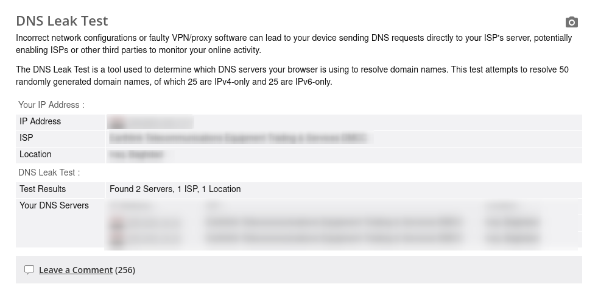
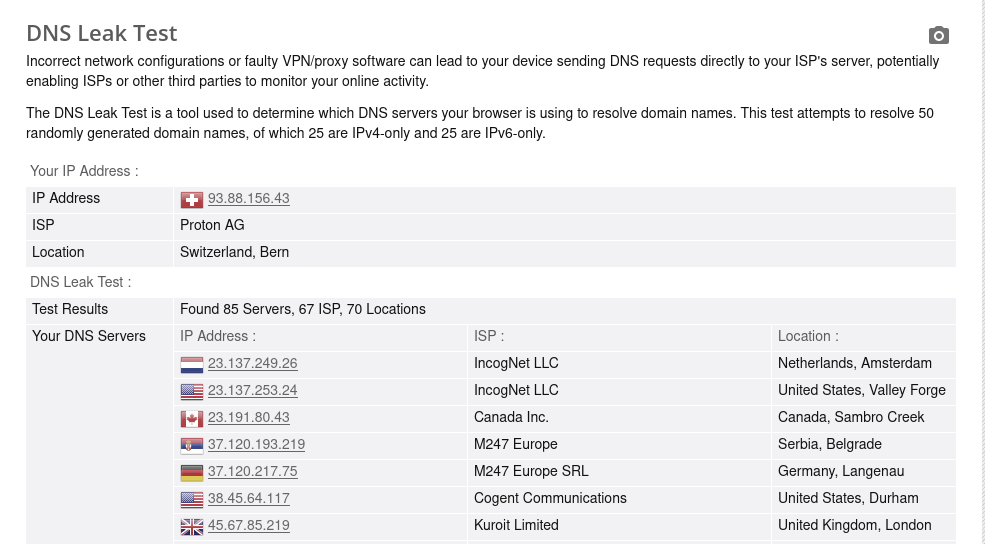

# GhostMode 👻

[](https://archlinux.org/)
[](https://opensource.org/licenses/MIT)
[](https://www.gnu.org/software/bash/)

An automated, strict privacy and anti-tracking script designed specifically for **Arch Linux** power users. **GhostMode** instantly hardens your system's network layer, obfuscates your physical identity, and routes your traffic through an encrypted tunnel with an aggressive fallback Kill Switch.

When you tear it down, it gracefully flushes your kernel firewall rules, prevents race conditions, and restores your system seamlessly to its factory state.

---

##  Features

* **Dynamic MAC Address Spoofing:** Instantly randomizes your hardware interface (`MAC address`) to obscure your vendor and hardware fingerprint on local routers.
* **Double-Hop Encrypted DNS:** Hardens `/etc/resolv.conf` using immutable flags (`chattr`) and routes all raw name requests through a local `dnscrypt-proxy` wrapper.
* **Aggressive IPv6 Leak Protection:** Fully disables IPv6 routing table leaks at the kernel level via `sysctl` variables while active.
* **ProtonVPN Enforcement:** Leverages Proton's open-source core to connect to the fastest secure nodes while locking down the connection with a strict native **Kill Switch**.
* **Bulletproof Teardown Engine:** Gracefully clears `iptables`/`nftables` on exit, re-allocates a factory DHCP lease, and forces a clean network handshake with your local ISP.
* **Sleek CLI Experience:** Includes an optimized non-blocking UI wrapper featuring dynamic ANSI terminal colors and sleek braille loader animations.

---


## Verification & Leak Test Proof

Here is a real-world benchmark analyzing the network state before and after running the `ghost` command on a standard connection, evaluated via *BrowserLeaks DNS Leak Test*:

### 1. Normal Mode (Exposed State)
Without the script running, local ISP tracking routing tables are fully transparent, exposing raw IP allocation and leaving name resolution queries vulnerable to local hardware monitoring logs:



### 2. Ghost Mode Active (Secured State)
Once `ghost enable` completes execution, hardware signatures are instantly spoofed, the underlying physical IP maps directly to Switzerland infrastructure, and DNS pathways undergo highly distributed multi-hop routing (randomized across 85 global nodes including IncogNet, M247 Europe, and Cogent) leaving **zero platform leaks**:



___

##  Prerequisites

Before installing, ensure your Arch Linux system has the required networking dependencies installed:

```bash
sudo pacman -S macchanger networkmanager dnscrypt-proxy
yay -S proton-vpn-gtk-app
```

**Note**: Make sure you have logged into your ProtonVPN CLI instance (`protonvpn-cli login`) at least once before executing the ghost parameters.

## Automated One-Liner Installation
Deploy the complete tool directly to your localized bin directory and hook it straight into your current Shell environment path config (`.bashrc` or .`zshrc`):

```bash
curl -sSL https://github.com/zoldyck13/GhostMode/releases/download/latest/install.sh | bash
```

After running the installer, reload your environment settings by executing `source` `~/.zshrc` or `source ~/.bashrc` based on your system configuration.

## Usage

Managing your network identity is condensed into two clean parameters:

*1.* __Go Dark (Enable Ghost Mode)__
Spoof hardware credentials, secure DNS channels, drop IPv6, spin up the VPN tunnel, and drop the blast shields:
```bash
ghost enable
```

*2.*__Go Visible (Disable Ghost Mode)__
Tear down tunnels, safely purge transient kernel firewalls, reset native MAC parameters, and cleanly re-negotiate local ISP DHCP configurations:

```bash
ghost disable
```

## ⚠️ Critical Operational Warning
[!WARNING]
__CRITICAL EXECUTION ORDER MANDATE__
You __MUST MANUALLY DISCONNECT__ from your VPN tunnel (`protonvpn-cli d` or via your desktop client) __BEFORE__ executing the teardown command (`ghost disable`).

__Why this matters__: Failure to terminate the active ProtonVPN state beforehand can cause the active Kill Switch and virtual interfaces (`tun0`) to trap routing configurations during the script's firewall flushing process. This can loop kernel rules, trigger a temporary network deadlock, or leave transient leaks before a fresh DHCP lease is cleanly re-negotiated with your local router.


